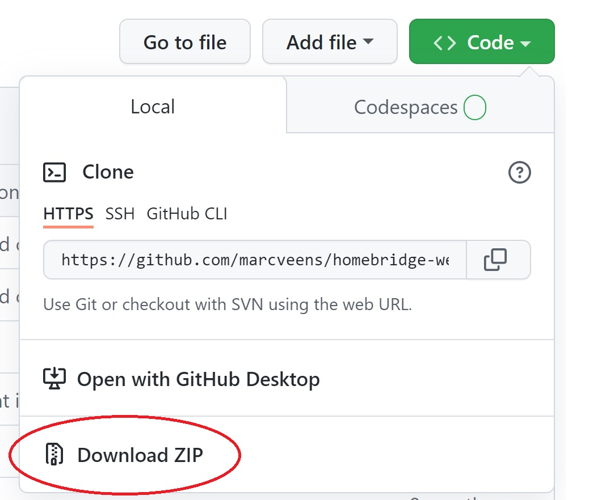

# Local debugging
Here's a guide for you on how to debug your script locally, including screenshots of every step taken. 

## Let's get started
1. Download this repository to your local machine  
2. Make sure you have [Node.js](https://nodejs.org/) installed on your machine. 
3. Also make sure you have [Chrome](https://www.google.com/chrome) installed on your machine. This will be used to run the test. Reference the Chrome executable in the `.env` file. For an example of how it should look, take a look at the `.env.example` file. 
4. Using a command line, navigate to the downloaded "homebridge-website-change-check" folder on your machine.
5. Run `npm install` in the command line to install all the required packages for running the script locally.
6. Run `npm run test:local` to see if the local test is working. One test is already configured by default. A success message should appear in the command line.

When all of this succeeded, you're ready to work on your own test! Keep in mind that the `npm run test:local` command you ran is working in "watch mode". This will cause the test to run automatically every time you make a change to it. Pretty handy, huh? 

The file you can work in is located at `src/__tests__/localDebugger.test.ts`. Over here you will see a setup that is configured exactly like the Homebridge plugin. Feel free to change these values to test your website-change-check locally.

## Screenshots
Every time the test runs, screenshots are made of the website you're running the experiment in. This includes a screenshot of the starting state, a screenshot of every `stepsBeforeCheck` step taken, and a screenshot of the final result. 

The screenshots can be found in `src/__tests__/screenshots`.

The screenshots might be very useful for debugging, since the final result might not always be what you expect it to be. You should be aware that some actions (submitting a form, clicking a link, opening a popup) are not instant, and thus require a `waitForMilliseconds` step to be added, just like you see in the default test that was added in the `localDebugger.test.ts` file.

## FAQ
__How can I run my test again without making a change?__ 
If you save the `localDebugger.test.ts` file again without making a change, the test will run again. 

__The tests fail because of "Error: page.screenshot: UNKNOWN: unknown error", why?__ 
This error appears when the script tries to write a screenshot to your file system, but you still have the screenshot open. Close the screenshot, save the `localDebugger.test.ts` file again and the test will rerun.